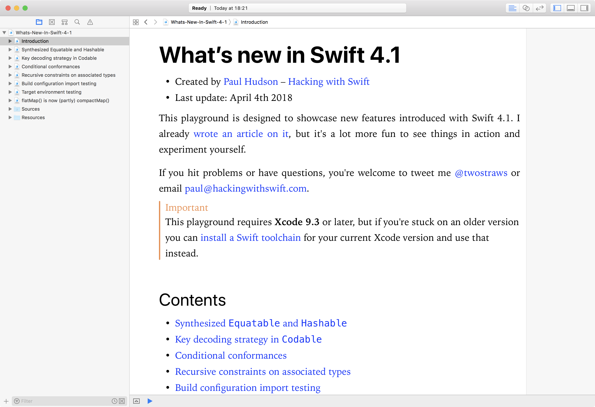

# What’s new in Swift 4.1?

This is an Xcode playground that demonstrates the new features introduced in Swift 4.1: 

* Synthesized `Equatable` and `Hashable`
* Key decoding strategy in `Codable`
* Conditional conformances
* Recursive constraints on associated types
* Build configuration import testing
* Target environment testing
* `flatMap()` is now (partly) `compactMap()`

This is designed to complement my existing article [What’s New in Swift 4.1](https://www.hackingwithswift.com/articles/50/whats-new-in-swift-4-1). You might also want to check out [What's New in Swift 4.2](https://www.hackingwithswift.com/articles/77/whats-new-in-swift-4-2) and its [accompanying playground](https://github.com/twostraws/whats-new-in-swift-4-2).

If you hit problems or have questions, you're welcome to tweet me [@twostraws](https://twitter.com/twostraws) or email <paul@hackingwithswift.com>.

**Note:** This playground requires Swift 4.1, so you should have installed Xcode 9.3 or later. This is available through the [Mac App Store](https://itunes.apple.com/gb/app/xcode/id497799835?mt=12) or direct from <https://developer.apple.com/download>.

